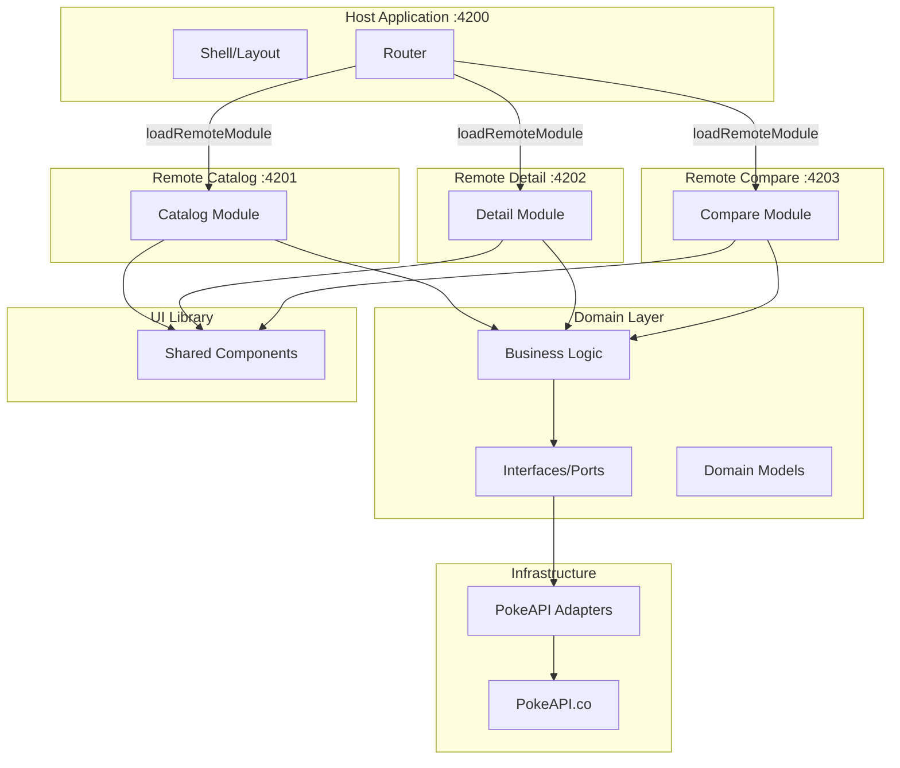

# Pokecomparator

[](https://angular.io/)
[](https://www.typescriptlang.org/)
[](https://webpack.js.org/concepts/module-federation/)

A modern Pokemon comparison application built with Angular 21, showcasing microfrontend architecture with Module Federation and hexagonal architecture principles.

## 📋 Table of Contents

- [About](#about)
- [Features](#features)
- [Tech Stack](#tech-stack)
- [Architecture Overview](#architecture-overview)
- [Quick Start](#quick-start)
- [Project Structure](#project-structure)
- [Development Commands](#development-commands)
- [Testing](#testing)
- [Documentation](#documentation)
- [Contributing](#contributing)
- [Data Source](#data-source)
- [License](#license)

## 🎯 About

Pokecomparator is a comprehensive web application that allows users to browse, view detailed information, and compare Pokemon using data from the PokeAPI. The project demonstrates advanced Angular development practices including microfrontend architecture using Webpack Module Federation and clean architecture principles with hexagonal (ports & adapters) pattern.

## ✨ Features

- **Pokemon Catalog**: Browse a paginated list of Pokemon with search functionality
- **Pokemon Detail View**: View detailed statistics, types, and characteristics with interactive charts
- **Side-by-Side Comparison**: Compare two Pokemon with visual stat comparisons
- **Responsive Design**: Fully responsive UI with light/dark theme support
- **Microfrontend Architecture**: Independent, modular features that can be developed and deployed separately
- **Type-Safe**: Built with TypeScript for enhanced developer experience and code reliability

## 🛠️ Tech Stack

### Core Framework
- **Angular 21** - Modern web framework with signals and standalone components
- **TypeScript 5.9** - Type-safe JavaScript
- **RxJS 7.8** - Reactive programming with observables

### Architecture
- **Module Federation** (@angular-architects/module-federation) - Microfrontend orchestration
- **Hexagonal Architecture** - Clean architecture with ports & adapters pattern
- **Domain-Driven Design** - Separation of business logic from infrastructure

### UI/UX
- **Custom Component Library** - Atomic design system with atoms and molecules
- **Storybook** - Component development and documentation
- **CSS Custom Properties** - Theme system with light/dark modes

### Development Tools
- **Angular CLI** - Build tooling and development server
- **ESLint** - Code quality and consistency
- **Prettier** - Code formatting
- **Vitest** - Fast unit testing
- **Compodoc** - Documentation generation

### Data Source
- **PokeAPI** - Comprehensive Pokemon data REST API

## 🏗️ Architecture Overview

Pokecomparator follows a **Hexagonal Architecture** (Ports & Adapters) combined with a **Microfrontend Architecture** using Webpack Module Federation.



### Architectural Principles

- **Dependency Inversion**: Domain layer defines interfaces (ports), infrastructure implements them
- **Independent Deployment**: Each microfrontend can be deployed independently
- **Shared Dependencies**: Common libraries (Angular, RxJS, Domain) are shared between remotes
- **Clean Separation**: Business logic isolated from UI and infrastructure concerns

For detailed architecture documentation, see [`docs/architecture/`](docs/architecture/) (coming soon in Phase 3).

## 🚀 Quick Start

### Prerequisites

- **Node.js** (v18 or higher)
- **npm** (v10.9.0 or higher)

### Installation

1. Clone the repository:
   ```bash
   git clone https://github.com/rgoussu-dev/PokeComparator.git
   cd PokeComparator
   ```

2. Install dependencies:
   ```bash
   npm install
   ```

3. Run all microfrontends:
   ```bash
   npm run run:all
   ```

4. Open your browser and navigate to:
   - **Host Application**: [http://localhost:4200](http://localhost:4200)
   - **Catalog (standalone)**: [http://localhost:4201](http://localhost:4201)
   - **Detail (standalone)**: [http://localhost:4202](http://localhost:4202)
   - **Compare (standalone)**: [http://localhost:4203](http://localhost:4203)

## 📁 Project Structure

The project is organized as a monorepo with multiple projects in the `projects/` directory:

```
projects/
├── host/                   # Main shell application (port 4200)
│   └── src/               # Orchestrates and loads remote microfrontends
│
├── remote-catalog/        # Pokemon catalog microfrontend (port 4201)
│   └── src/              # List view with search and pagination
│
├── remote-detail/         # Pokemon detail microfrontend (port 4202)
│   └── src/              # Individual Pokemon details with charts
│
├── remote-compare/        # Pokemon comparison microfrontend (port 4203)
│   └── src/              # Side-by-side Pokemon comparison
│
├── domain/                # Domain layer (Hexagonal core)
│   └── src/lib/
│       ├── models/       # Domain entities (PokemonSummary, PokemonDetail, etc.)
│       ├── ports/        # Interfaces/contracts (PokemonRepository, etc.)
│       └── services/     # Business logic (PokemonCatalogService, ComparisonService, etc.)
│
├── infra/                 # Infrastructure layer (Adapters)
│   └── src/lib/
│       └── adapters/     # PokeAPI implementations
│
└── ui/                    # Shared component library
    └── src/lib/
        ├── atoms/        # Basic components (button, input, etc.)
        └── molecule/     # Composite components (header, searchbar, etc.)
```

### Key Concepts

- **Host**: Shell application that provides routing and loads remote microfrontends dynamically
- **Remotes**: Independent feature modules exposed via Module Federation
- **Domain**: Business logic layer following hexagonal architecture, framework-agnostic
- **Infrastructure**: Adapters implementing domain ports (e.g., PokeAPI integration)
- **UI**: Reusable component library following atomic design principles

## ⚙️ Development Commands

| Command | Description |
|---------|-------------|
| `npm run run:all` | Start all microfrontends in parallel (host + remotes) |
| `npm start` | Start only the host application |
| `npm run build` | Build all projects for production |
| `npm run watch` | Build in watch mode for development |
| `npm test` | Run unit tests with Vitest |
| `npm run lint` | Lint all projects with ESLint |
| `ng run ui:storybook` | Launch Storybook component explorer |
| `ng run ui:build-storybook` | Build Storybook for deployment |

### Working with Individual Projects

Run commands for specific projects using Angular CLI:

```bash
# Serve a specific remote
ng serve remote-catalog

# Build a specific project
ng build domain

# Test a specific project
ng test host

# Lint a specific project
ng lint infra
```

### Creating New Components

Generate components within a project:

```bash
# Create a component in a specific project
ng generate component <path-to-component> --project=<project-name>

# Example: Create a new component in the catalog
ng generate component catalog/components/pokemon-filter --project=remote-catalog
```

## 🧪 Testing

The project uses **Vitest** for unit testing with a focus on testing business logic in the domain layer and component behavior.

### Running Tests

```bash
# Run all tests
npm test

# Run tests for a specific project
ng test domain

# Run tests in watch mode
npm test -- --watch

# Run tests with coverage
npm test -- --coverage
```

### Testing Strategy

> **Note**: As of now, testing has been done primarily manually. Automated test coverage is minimal and will be expanded in future iterations.

- **Domain Layer**: Business logic and services (use cases) - automated tests to be added
- **Components**: User interactions and component behavior - primarily manual testing
- **Adapters**: Data transformation and API integration - primarily manual testing
- **End-to-End**: Manual testing of integrated microfrontends

## 📚 Documentation

### Available Documentation

- **This README**: Project overview and quick start
- **[AGENTS.md](AGENTS.md)**: Instructions for AI-assisted development with coding agents
- **[Angular Guidelines](docs/angular-guidelines.md)**: Project-specific Angular conventions
- **[Deployment Guide](docs/deployment/)**: Deployment configurations and instructions

### Coming Soon

- **Architecture Documentation** (`docs/architecture/`): Detailed architecture explanations
- **Project READMEs**: Individual README files for each project/microfrontend
- **API Documentation**: Generated with Compodoc
- **Component Documentation**: Storybook stories for UI components

### Generating Documentation

```bash
# Generate Compodoc documentation (when configured)
npm run docs

# Serve Compodoc documentation
npm run docs:serve

# Open Storybook
ng run ui:storybook
```

## 🤝 Contributing

### Development Guidelines

1. **Follow Angular Style Guide**: Adhere to Angular coding conventions
2. **Hexagonal Architecture**: Keep domain logic independent of framework
3. **Atomic Design**: Use and contribute to the UI component library
4. **Test Your Code**: Write tests for new features and bug fixes
5. **Document Your Work**: Add JSDoc comments for public APIs

### Working with AI Coding Agents

This project supports AI-assisted development. See **[AGENTS.md](AGENTS.md)** for detailed instructions on using coding agents effectively with this codebase.

### Code Style

The project uses:
- **ESLint** for code quality rules
- **Prettier** for code formatting (printWidth: 100, singleQuote: true)
- **Angular ESLint** for Angular-specific rules

Run linting before committing:
```bash
npm run lint
```

## 🗄️ Data Source

This project uses data from **[PokeAPI](https://pokeapi.co/)** - a free and open Pokemon API.

Special thanks to the PokeAPI team for providing comprehensive Pokemon data:
- Website: [https://pokeapi.co/](https://pokeapi.co/)
- Documentation: [https://pokeapi.co/docs/v2](https://pokeapi.co/docs/v2)

All Pokemon names, stats, and related data are © Pokemon / Nintendo.

## 📄 License

This project is for educational and demonstration purposes. Pokemon and related characters are trademarks of Nintendo, Game Freak, and Creatures Inc.

---

**Built with ❤️ using Angular 21 and Hexagonal Architecture**