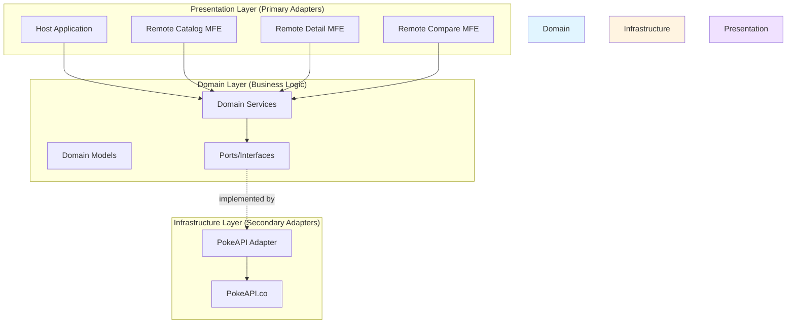
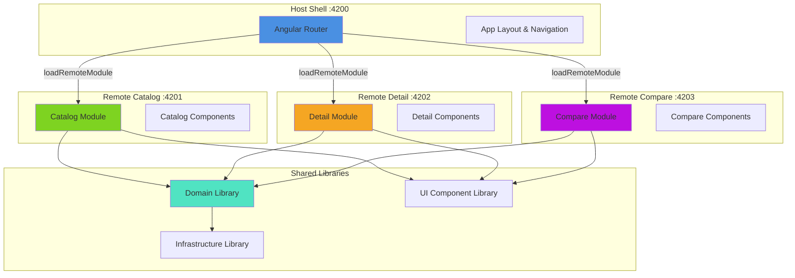

# Architecture Overview

Pokecomparator follows a **Hexagonal Architecture** (Ports & Adapters) combined with a **Microfrontend Architecture** using Webpack Module Federation.

## Quick Links

- [Hexagonal Architecture](./hexagonal-architecture.md) - Understand the domain-centric design
- [Microfrontend Setup](./microfrontend-setup.md) - Learn about the Module Federation configuration
- [Data Flow](./data-flow.md) - See how data flows through the application

## High-Level System Architecture

The Pokecomparator application is built on two key architectural patterns:

### 1. Hexagonal Architecture (Ports & Adapters)

The business logic is isolated in the **Domain** layer, which defines ports (interfaces) that are implemented by adapters in the **Infrastructure** and **UI** layers. This ensures:

- **Domain independence**: Business logic doesn't depend on external frameworks or APIs
- **Testability**: Each layer can be tested in isolation
- **Flexibility**: Easy to swap implementations (e.g., different API providers)



### 2. Microfrontend Architecture

The application is split into independently deployable microfrontends, each responsible for a specific feature:

- **Host** (port 4200): Shell application that orchestrates the microfrontends
- **Remote Catalog** (port 4201): Pokemon listing and search feature
- **Remote Detail** (port 4202): Individual Pokemon details with charts
- **Remote Compare** (port 4203): Side-by-side Pokemon comparison



## Key Design Principles

### Separation of Concerns

- **Domain Layer**: Pure business logic, framework-agnostic
- **Infrastructure Layer**: External integrations (PokeAPI)
- **UI Layer**: Presentation logic and user interactions
- **Microfrontends**: Feature-based separation for independent development

### Dependency Rule

Dependencies flow inward:

```
UI/Microfrontends → Domain → Infrastructure → External APIs
```

The Domain layer never depends on outer layers, ensuring business logic remains independent.

### Shared Dependencies

All microfrontends share:
- Angular framework libraries (singleton mode)
- Domain library (business logic)
- Infrastructure library (API adapters)
- UI library (design system components)

This reduces bundle size and ensures consistency across the application.

## Technology Stack

| Layer | Technology |
|-------|-----------|
| **Framework** | Angular 21 |
| **Microfrontends** | Webpack Module Federation (@angular-architects/module-federation) |
| **State Management** | Angular Signals |
| **HTTP Client** | Angular HttpClient |
| **Routing** | Angular Router |
| **API** | PokeAPI (https://pokeapi.co) |
| **UI Components** | Custom component library with atomic design |

## Project Structure

```
projects/
├── host/              # Shell application (port 4200)
├── remote-catalog/    # Pokemon catalog MFE (port 4201)
├── remote-detail/     # Pokemon detail MFE (port 4202)
├── remote-compare/    # Pokemon comparison MFE (port 4203)
├── domain/            # Business logic library
├── infra/             # Infrastructure adapters library
└── ui/                # Shared UI component library
```

## Getting Started

For detailed information on each architectural aspect:

1. **[Hexagonal Architecture](./hexagonal-architecture.md)** - Learn about the domain-driven design pattern
2. **[Microfrontend Setup](./microfrontend-setup.md)** - Understand the Module Federation configuration
3. **[Data Flow](./data-flow.md)** - Follow data through the application layers

## Further Reading

- [Angular Architecture Guidelines](../angular-guidelines.md)
- [Project READMEs](../../projects/) - Detailed documentation for each project
- [PokeAPI Documentation](https://pokeapi.co/docs/v2)
