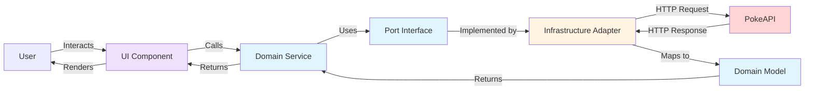
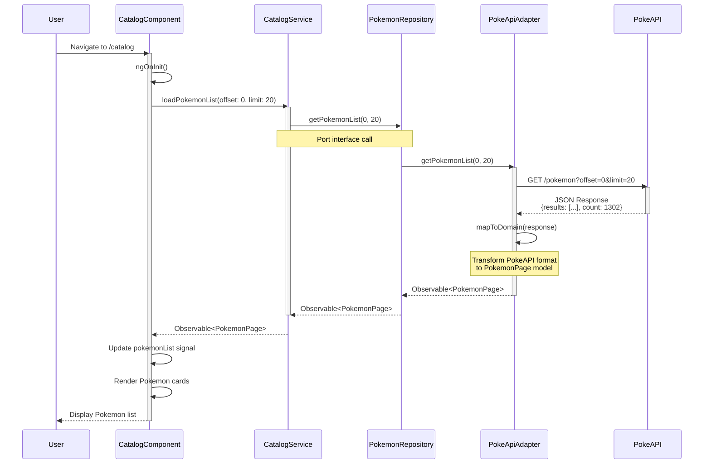
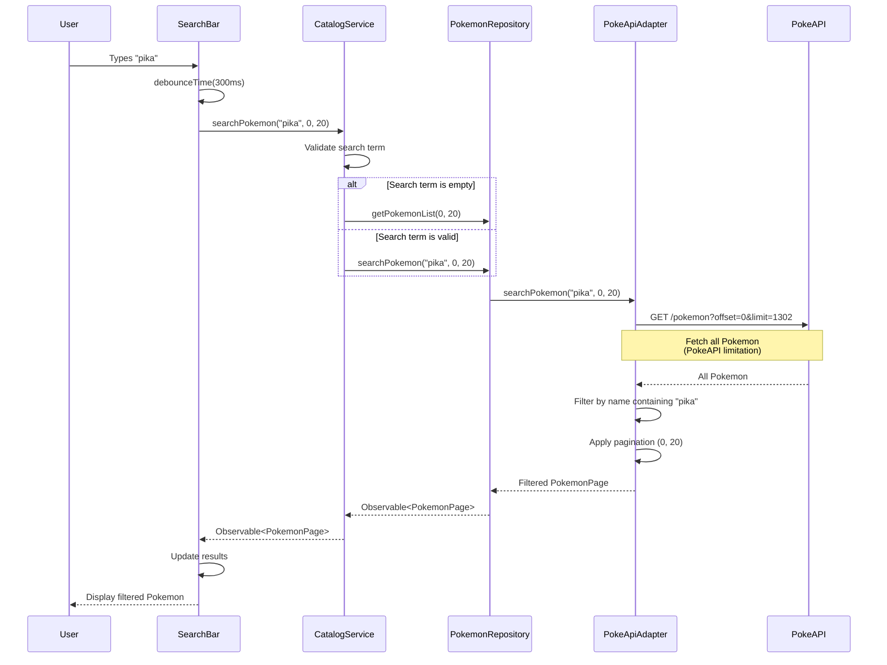
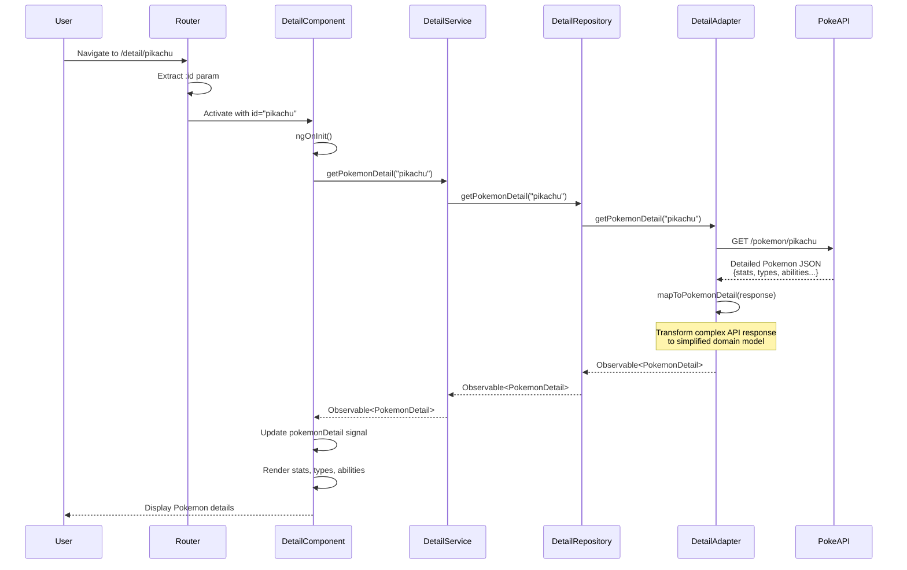
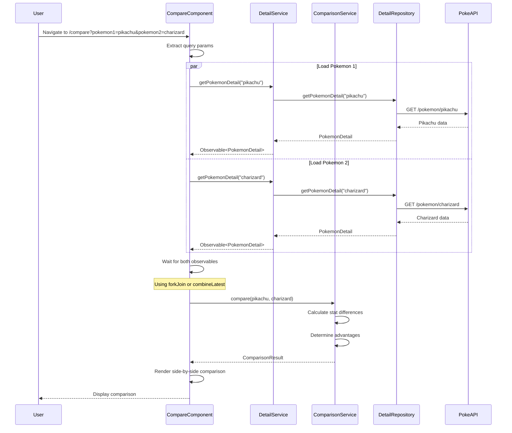

# Data Flow

## Overview

This document explains how data flows through the Pokecomparator application, from user interactions through the domain layer to external API calls and back to the UI.

Understanding the data flow helps developers:
- Trace how features work end-to-end
- Debug issues more effectively
- Understand where to add new functionality
- Maintain consistency with existing patterns

## General Data Flow Pattern

All features in Pokecomparator follow a consistent layered data flow:



### Key Principles

1. **Unidirectional Flow**: Data flows in one direction through the layers
2. **Separation of Concerns**: Each layer has a specific responsibility
3. **Domain-Centric**: Business logic stays in the domain layer
4. **Reactive**: Uses RxJS Observables for asynchronous data handling
5. **Type Safety**: Strong typing throughout with TypeScript interfaces

## Catalog Flow: Loading Pokemon List

This is the most common flow, used when users visit the catalog page.

### Sequence Diagram



### Code Flow

#### 1. UI Component Initiates Request

```typescript
// projects/remote-catalog/src/app/catalog/components/poke-catalog/poke-catalog.ts

export class PokeCatalogComponent implements OnInit {
  pokemonList = signal<PokemonSummary[]>([]);
  
  constructor(private catalogService: PokemonCatalogService) {}
  
  ngOnInit(): void {
    this.loadPokemon(0, 20);
  }
  
  private loadPokemon(offset: number, limit: number): void {
    this.catalogService
      .loadPokemonList(offset, limit)
      .subscribe(page => {
        this.pokemonList.set(page.results);
      });
  }
}
```

#### 2. Domain Service Processes Request

```typescript
// projects/domain/src/lib/services/pokemon-catalog.service.ts

@Injectable({ providedIn: 'root' })
export class PokemonCatalogService {
  constructor(private repository: PokemonRepository) {}
  
  loadPokemonList(offset: number, limit: number): Observable<PokemonPage> {
    // Business logic can be added here (validation, caching, etc.)
    return this.repository.getPokemonList(offset, limit);
  }
}
```

#### 3. Adapter Calls External API

```typescript
// projects/infra/src/lib/adapters/pokeapi.adapter.ts

@Injectable()
export class PokeApiAdapter implements PokemonRepository {
  private baseUrl = 'https://pokeapi.co/api/v2';
  
  constructor(private http: HttpClient) {}
  
  getPokemonList(offset: number, limit: number): Observable<PokemonPage> {
    return this.http
      .get<PokeApiResponse>(`${this.baseUrl}/pokemon`, {
        params: { 
          offset: offset.toString(), 
          limit: limit.toString() 
        }
      })
      .pipe(
        map(response => this.mapToDomain(response)),
        catchError(error => this.handleError(error))
      );
  }
  
  private mapToDomain(response: PokeApiResponse): PokemonPage {
    return {
      results: response.results.map(item => ({
        name: item.name,
        url: item.url,
        id: this.extractIdFromUrl(item.url)
      })),
      count: response.count,
      next: response.next,
      previous: response.previous
    };
  }
}
```

## Search Flow: Finding Pokemon by Name

Similar to catalog flow but with additional filtering logic.

### Sequence Diagram



### Key Difference

The search flow includes client-side filtering because PokeAPI doesn't support search by name:

```typescript
// In PokeApiAdapter
searchPokemon(searchTerm: string, offset: number, limit: number): Observable<PokemonPage> {
  // Fetch all Pokemon
  return this.http.get<PokeApiResponse>(`${this.baseUrl}/pokemon?limit=1302`)
    .pipe(
      map(response => {
        // Filter results by name
        const filtered = response.results.filter(p => 
          p.name.toLowerCase().includes(searchTerm.toLowerCase())
        );
        
        // Apply pagination
        const paginatedResults = filtered.slice(offset, offset + limit);
        
        return {
          results: paginatedResults.map(this.mapToPokemonSummary),
          count: filtered.length,
          next: offset + limit < filtered.length ? 'next' : null,
          previous: offset > 0 ? 'previous' : null
        };
      })
    );
}
```

## Detail Flow: Loading Individual Pokemon

Loads detailed information about a single Pokemon, including stats, types, abilities.

### Sequence Diagram



### Data Transformation

The adapter transforms complex PokeAPI data into a simplified domain model:

```typescript
// API Response (complex)
{
  id: 25,
  name: "pikachu",
  height: 4,
  weight: 60,
  stats: [
    { base_stat: 35, stat: { name: "hp" } },
    { base_stat: 55, stat: { name: "attack" } },
    // ... more stats
  ],
  types: [
    { slot: 1, type: { name: "electric" } }
  ],
  abilities: [
    { ability: { name: "static" }, is_hidden: false }
  ],
  sprites: {
    front_default: "https://...",
    other: { ... }
  }
}

// Domain Model (simplified)
{
  id: 25,
  name: "pikachu",
  height: 4,
  weight: 60,
  stats: {
    hp: 35,
    attack: 55,
    defense: 40,
    specialAttack: 50,
    specialDefense: 50,
    speed: 90
  },
  types: ["electric"],
  abilities: ["static", "lightning-rod"],
  sprite: "https://...",
  spriteShiny: "https://..."
}
```

## Comparison Flow: Comparing Two Pokemon

Most complex flow as it loads two Pokemon in parallel and computes differences.

### Sequence Diagram



### Parallel Loading

The component loads both Pokemon in parallel using `forkJoin`:

```typescript
// projects/remote-compare/src/app/compare/components/compare.ts

export class CompareComponent implements OnInit {
  comparison = signal<ComparisonResult | null>(null);
  
  constructor(
    private route: ActivatedRoute,
    private detailService: PokemonDetailService,
    private comparisonService: ComparisonService
  ) {}
  
  ngOnInit(): void {
    this.route.queryParams.subscribe(params => {
      const id1 = params['pokemon1'];
      const id2 = params['pokemon2'];
      
      if (id1 && id2) {
        this.loadComparison(id1, id2);
      }
    });
  }
  
  private loadComparison(id1: string, id2: string): void {
    forkJoin([
      this.detailService.getPokemonDetail(id1),
      this.detailService.getPokemonDetail(id2)
    ]).subscribe(([pokemon1, pokemon2]) => {
      const result = this.comparisonService.compare(pokemon1, pokemon2);
      this.comparison.set(result);
    });
  }
}
```

### Comparison Logic

The comparison service computes differences:

```typescript
// projects/domain/src/lib/services/comparison.service.ts

@Injectable({ providedIn: 'root' })
export class ComparisonService {
  compare(pokemon1: PokemonDetail, pokemon2: PokemonDetail): ComparisonResult {
    return {
      pokemon1,
      pokemon2,
      statDifferences: this.calculateStatDifferences(pokemon1, pokemon2),
      winner: this.determineWinner(pokemon1, pokemon2),
      advantages: this.calculateAdvantages(pokemon1, pokemon2)
    };
  }
  
  private calculateStatDifferences(p1: PokemonDetail, p2: PokemonDetail) {
    return {
      hp: p2.stats.hp - p1.stats.hp,
      attack: p2.stats.attack - p1.stats.attack,
      defense: p2.stats.defense - p1.stats.defense,
      // ... more stats
    };
  }
}
```

## State Management

### Signal-Based State

Pokecomparator uses Angular Signals for reactive state management:

```typescript
export class PokeCatalogComponent {
  // Signal holding the current Pokemon list
  pokemonList = signal<PokemonSummary[]>([]);
  
  // Computed signal for filtered results
  filteredList = computed(() => {
    const search = this.searchTerm();
    const list = this.pokemonList();
    return list.filter(p => p.name.includes(search));
  });
  
  // Effect that runs when signals change
  constructor() {
    effect(() => {
      console.log('Pokemon list updated:', this.pokemonList().length);
    });
  }
}
```

### Component State vs Service State

- **Component State**: UI-specific state (loading flags, selected items, form values)
- **Service State**: Shared state managed by domain services

```typescript
// Component state (local)
export class CatalogComponent {
  isLoading = signal<boolean>(false);
  selectedPokemon = signal<PokemonSummary | null>(null);
}

// Domain service (actual implementation)
@Injectable()
export class PokemonCatalogService {
  private readonly repository = inject(POKEMON_REPOSITORY);
  
  /**
   * Retrieves a paginated list of Pokemon with optional filtering
   */
  getPokemonList(pagination: PaginationParams, filter?: PokemonFilter): Observable<PokemonPage> {
    return this.repository.getPokemonList(pagination, filter);
  }
  
  /**
   * Search Pokemon by name (convenience method with default pagination)
   */
  searchPokemon(query: string, limit = 5): Observable<PokemonPage> {
    return this.repository.getPokemonList(
      { page: 1, pageSize: limit },
      { search: query }
    );
  }
}
```

## Error Handling

Errors are handled at multiple levels:

### Adapter Level

```typescript
// In PokeApiAdapter
getPokemonList(offset: number, limit: number): Observable<PokemonPage> {
  return this.http.get<PokeApiResponse>(`${this.baseUrl}/pokemon`, { params })
    .pipe(
      catchError(error => {
        console.error('PokeAPI error:', error);
        if (error.status === 404) {
          return of({ results: [], count: 0, next: null, previous: null });
        }
        return throwError(() => new Error('Failed to load Pokemon'));
      })
    );
}
```

### Service Level

```typescript
// In PokemonCatalogService
loadPokemonList(offset: number, limit: number): Observable<PokemonPage> {
  return this.repository.getPokemonList(offset, limit)
    .pipe(
      retry(2), // Retry twice on failure
      catchError(error => {
        // Log error for monitoring
        console.error('Catalog service error:', error);
        // Return empty result
        return of({ results: [], count: 0, next: null, previous: null });
      })
    );
}
```

### Component Level

```typescript
// In Component
loadPokemon(): void {
  this.isLoading.set(true);
  this.catalogService.loadPokemonList(0, 20)
    .subscribe({
      next: (page) => {
        this.pokemonList.set(page.results);
        this.isLoading.set(false);
      },
      error: (error) => {
        this.errorMessage.set('Failed to load Pokemon. Please try again.');
        this.isLoading.set(false);
      }
    });
}
```

## Performance Optimizations

### Lazy Loading

Microfrontends are loaded only when needed:

```typescript
// Route configuration
{
  path: 'catalog',
  loadChildren: () => loadRemoteModule(...)
  // Only loads when user navigates to /catalog
}
```

### Pagination

Large datasets are paginated:

```typescript
loadPage(pageNumber: number): void {
  const offset = pageNumber * this.pageSize;
  this.catalogService.loadPokemonList(offset, this.pageSize)
    .subscribe(page => {
      this.pokemonList.set(page.results);
    });
}
```

### Caching

Frequently accessed data is cached:

```typescript
private cache = new Map<string, PokemonDetail>();

getPokemonDetail(id: string): Observable<PokemonDetail> {
  if (this.cache.has(id)) {
    return of(this.cache.get(id)!);
  }
  return this.repository.getPokemonDetail(id)
    .pipe(tap(detail => this.cache.set(id, detail)));
}
```

### Debouncing

Search input is debounced to reduce API calls:

```typescript
searchTerm$ = new Subject<string>();

constructor() {
  this.searchTerm$
    .pipe(
      debounceTime(300),  // Wait 300ms after last keystroke
      distinctUntilChanged()
    )
    .subscribe(term => {
      this.performSearch(term);
    });
}
```

## Related Documentation

- [Architecture Overview](./README.md) - High-level architecture
- [Hexagonal Architecture](./hexagonal-architecture.md) - Domain layer design
- [Microfrontend Setup](./microfrontend-setup.md) - Microfrontend configuration
- [Domain Library README](../../projects/domain/README.md) - Domain services and models
- [Infrastructure Library README](../../projects/infra/README.md) - Adapter implementations
