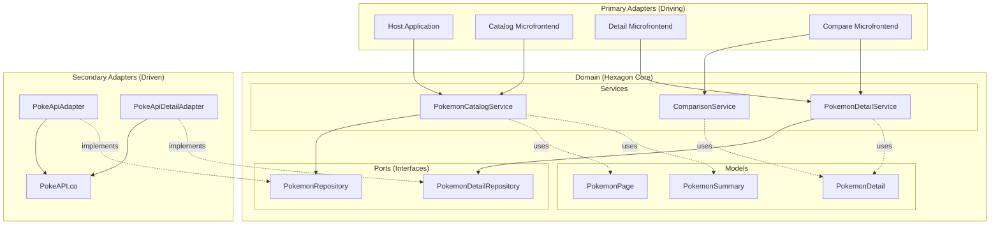

# Hexagonal Architecture

## What is Hexagonal Architecture?

Hexagonal Architecture, also known as **Ports and Adapters**, is an architectural pattern that aims to create loosely coupled application components that can be easily connected to their software environment through ports and adapters.

The key idea is to isolate the core business logic (the "domain") from external concerns like databases, APIs, UI frameworks, and other infrastructure.

### Core Concepts

- **Domain (Hexagon Core)**: Contains the business logic, domain models, and business rules
- **Ports**: Interfaces that define how the domain interacts with the outside world
- **Adapters**: Implementations of ports that connect to external systems
- **Primary Adapters (Driving)**: Trigger domain operations (e.g., UI, API controllers)
- **Secondary Adapters (Driven)**: Triggered by domain operations (e.g., database, external APIs)

### Benefits

1. **Independence**: Business logic is independent of frameworks, databases, and external agencies
2. **Testability**: Domain logic can be tested without external dependencies
3. **Flexibility**: Easy to swap implementations (e.g., mock API adapter for testing)
4. **Maintainability**: Clear separation of concerns makes code easier to understand and modify
5. **Delayed Decisions**: Technology choices can be deferred until necessary

## How It's Applied in Pokecomparator

### The Hexagon: Domain Layer

The `@domain` library is the heart of the application. It contains:

- **Models**: Domain entities like `PokemonSummary`, `PokemonDetail`, `PokemonPage`
- **Ports**: Interfaces defining contracts (`PokemonRepository`, `PokemonDetailRepository`)
- **Services**: Business logic (`PokemonCatalogService`, `PokemonDetailService`, `ComparisonService`)

**Key characteristic**: The domain has **zero dependencies** on Angular, HTTP, or any external framework.

### Primary Adapters (Driving Side)

These adapters **drive** the application by invoking domain services:

- **Host Application** (`projects/host/`)
- **Remote Catalog** (`projects/remote-catalog/`)
- **Remote Detail** (`projects/remote-detail/`)
- **Remote Compare** (`projects/remote-compare/`)

These Angular components and modules call domain services to perform business operations.

### Secondary Adapters (Driven Side)

These adapters are **driven by** the domain to interact with external systems:

- **PokeApiAdapter** (`projects/infra/src/lib/adapters/pokeapi.adapter.ts`)
- **PokeApiDetailAdapter** (`projects/infra/src/lib/adapters/pokeapi-detail.adapter.ts`)

These adapters implement the port interfaces defined in the domain and handle communication with the PokeAPI.

## Architectural Diagram



## The Dependency Rule

The fundamental rule of Hexagonal Architecture is the **Dependency Rule**:

> **Dependencies point inward. Inner layers never depend on outer layers.**

In Pokecomparator:

```
Primary Adapters → Domain → Secondary Adapters → External Systems
    (UI)         (Services)    (Infrastructure)       (PokeAPI)
```

### What This Means

- **Domain services** don't know about Angular, HTTP, or the PokeAPI
- **Domain services** only depend on port interfaces
- **Adapters** know about the domain but the domain doesn't know about adapters
- **Primary adapters** inject domain services
- **Secondary adapters** are injected into services via dependency injection

## Code Examples

### Port Definition (Domain Layer)

```typescript
// projects/domain/src/lib/ports/pokemon.repository.ts

/**
 * Port interface for Pokemon repository operations.
 * This interface defines the contract that infrastructure adapters must implement.
 */
export interface PokemonRepository {
  /**
   * Retrieves a paginated list of Pokemon.
   * @param offset - The starting position in the list
   * @param limit - The maximum number of Pokemon to retrieve
   * @returns Observable of PokemonPage containing the results
   */
  getPokemonList(offset: number, limit: number): Observable<PokemonPage>;
  
  /**
   * Searches for Pokemon by name.
   * @param searchTerm - The search term to filter Pokemon names
   * @param offset - The starting position in the list
   * @param limit - The maximum number of results
   * @returns Observable of PokemonPage containing matching Pokemon
   */
  searchPokemon(searchTerm: string, offset: number, limit: number): Observable<PokemonPage>;
}
```

### Adapter Implementation (Infrastructure Layer)

```typescript
// projects/infra/src/lib/adapters/pokeapi.adapter.ts

/**
 * PokeAPI adapter implementing the PokemonRepository port.
 * Handles communication with the external PokeAPI service.
 */
@Injectable()
export class PokeApiAdapter implements PokemonRepository {
  private baseUrl = 'https://pokeapi.co/api/v2';

  constructor(private http: HttpClient) {}

  getPokemonList(offset: number, limit: number): Observable<PokemonPage> {
    return this.http
      .get<PokeApiResponse>(`${this.baseUrl}/pokemon`, {
        params: { offset: offset.toString(), limit: limit.toString() }
      })
      .pipe(
        map(response => this.mapToDomain(response))
      );
  }

  private mapToDomain(response: PokeApiResponse): PokemonPage {
    // Transform PokeAPI response to domain model
    return {
      results: response.results.map(this.mapToPokemonSummary),
      count: response.count,
      next: response.next,
      previous: response.previous
    };
  }
}
```

### Service Usage (Domain Layer)

```typescript
// projects/domain/src/lib/services/pokemon-catalog.service.ts

/**
 * Service managing Pokemon catalog operations.
 * Uses the PokemonRepository port to retrieve data.
 */
@Injectable({ providedIn: 'root' })
export class PokemonCatalogService {
  constructor(private repository: PokemonRepository) {}

  /**
   * Loads a paginated list of Pokemon.
   */
  loadPokemonList(offset: number, limit: number): Observable<PokemonPage> {
    return this.repository.getPokemonList(offset, limit);
  }

  /**
   * Searches for Pokemon by name.
   */
  searchPokemon(searchTerm: string, offset: number, limit: number): Observable<PokemonPage> {
    if (!searchTerm || searchTerm.trim() === '') {
      return this.loadPokemonList(offset, limit);
    }
    return this.repository.searchPokemon(searchTerm, offset, limit);
  }
}
```

### Dependency Injection Configuration

In Angular, we wire up the ports and adapters using dependency injection:

```typescript
// Application configuration (app.config.ts or providers array)

export const appConfig: ApplicationConfig = {
  providers: [
    // Bind the port interface to the adapter implementation
    {
      provide: PokemonRepository,
      useClass: PokeApiAdapter
    },
    {
      provide: PokemonDetailRepository,
      useClass: PokeApiDetailAdapter
    },
    // Other providers...
  ]
};
```

### Primary Adapter Usage (UI Layer)

```typescript
// projects/remote-catalog/src/app/catalog/components/poke-catalog/poke-catalog.ts

@Component({
  selector: 'pc-poke-catalog',
  templateUrl: './poke-catalog.html',
  styleUrls: ['./poke-catalog.scss']
})
export class PokeCatalogComponent implements OnInit {
  // Inject domain service (not the adapter!)
  constructor(private catalogService: PokemonCatalogService) {}

  ngOnInit(): void {
    // Call domain service, which internally uses the repository port
    this.catalogService
      .loadPokemonList(0, 20)
      .subscribe(page => {
        this.pokemonList = page.results;
      });
  }
}
```

## Testing Benefits

The hexagonal architecture makes testing straightforward:

### Unit Testing Domain Services

```typescript
describe('PokemonCatalogService', () => {
  let service: PokemonCatalogService;
  let mockRepository: jasmine.SpyObj<PokemonRepository>;

  beforeEach(() => {
    // Create a mock implementation of the port
    mockRepository = jasmine.createSpyObj('PokemonRepository', [
      'getPokemonList',
      'searchPokemon'
    ]);

    // Inject the mock
    service = new PokemonCatalogService(mockRepository);
  });

  it('should call repository with correct parameters', () => {
    const mockPage: PokemonPage = { /* test data */ };
    mockRepository.getPokemonList.and.returnValue(of(mockPage));

    service.loadPokemonList(0, 20).subscribe();

    expect(mockRepository.getPokemonList).toHaveBeenCalledWith(0, 20);
  });
});
```

### Integration Testing Adapters

```typescript
describe('PokeApiAdapter', () => {
  let adapter: PokeApiAdapter;
  let httpMock: HttpTestingController;

  beforeEach(() => {
    TestBed.configureTestingModule({
      imports: [HttpClientTestingModule],
      providers: [PokeApiAdapter]
    });

    adapter = TestBed.inject(PokeApiAdapter);
    httpMock = TestBed.inject(HttpTestingController);
  });

  it('should map PokeAPI response to domain model', () => {
    const mockApiResponse = { /* PokeAPI format */ };
    const expectedDomainModel = { /* Domain format */ };

    adapter.getPokemonList(0, 20).subscribe(result => {
      expect(result).toEqual(expectedDomainModel);
    });

    const req = httpMock.expectOne('https://pokeapi.co/api/v2/pokemon?offset=0&limit=20');
    req.flush(mockApiResponse);
  });
});
```

## Key Takeaways

1. **Domain independence**: Business logic doesn't depend on frameworks or external APIs
2. **Ports define contracts**: Interfaces specify what the domain needs, not how it's implemented
3. **Adapters are swappable**: Easy to replace PokeAPI with another source or add caching
4. **Testing is easier**: Mock ports instead of complex infrastructure
5. **Clear boundaries**: Each layer has well-defined responsibilities

## Related Documentation

- [Data Flow](./data-flow.md) - See how data flows through the hexagonal layers
- [Microfrontend Setup](./microfrontend-setup.md) - Learn about the presentation layer architecture
- [Domain Library README](../../projects/domain/README.md) - Detailed domain documentation
- [Infrastructure Library README](../../projects/infra/README.md) - Adapter implementations
