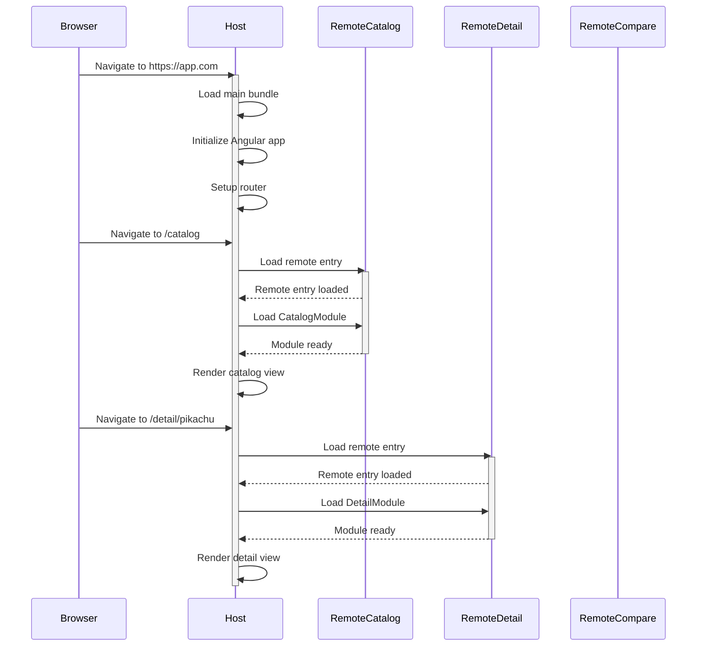
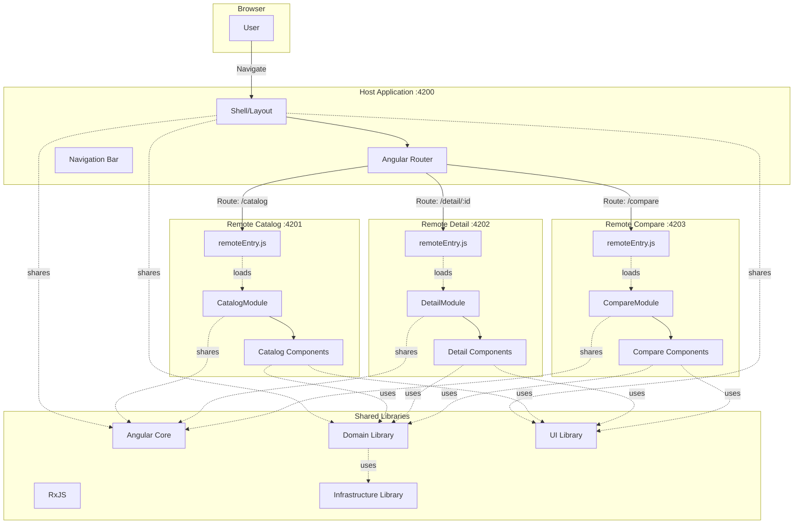

# Microfrontend Setup

## What are Microfrontends?

Microfrontends extend the concept of microservices to the frontend world. Instead of a monolithic frontend application, the UI is composed of semi-independent fragments that can be built, tested, and deployed independently.

### Benefits

1. **Independent Development**: Teams can work on different features without conflicts
2. **Independent Deployment**: Deploy one microfrontend without redeploying the entire application
3. **Technology Flexibility**: Different microfrontends can use different versions of libraries (with care)
4. **Scalability**: Easier to scale development across multiple teams
5. **Fault Isolation**: Issues in one microfrontend don't crash the entire application

### Trade-offs

- **Complexity**: More complex build and deployment setup
- **Bundle Size**: Potential for duplication if not carefully managed
- **Consistency**: Requires discipline to maintain UX consistency
- **Communication**: Inter-microfrontend communication requires careful design

## Pokecomparator's Microfrontend Architecture

The application is split into four main applications:

| Application | Port | Role | Description |
|------------|------|------|-------------|
| **Host** | 4200 | Shell | Main container, routing, layout, navigation |
| **Remote Catalog** | 4201 | Feature | Pokemon listing and search |
| **Remote Detail** | 4202 | Feature | Individual Pokemon details with charts |
| **Remote Compare** | 4203 | Feature | Side-by-side Pokemon comparison |

## Module Federation

Pokecomparator uses **Webpack Module Federation** via the `@angular-architects/module-federation` library. This allows:

- Runtime loading of remote modules
- Shared dependencies to reduce bundle size
- Independent builds and deployments

### How Module Federation Works



## Configuration

### Host Configuration

The host application is the shell that loads remote modules:

```javascript
// projects/host/webpack.config.js

const { shareAll, withModuleFederationPlugin } = require('@angular-architects/module-federation/webpack');

const config = withModuleFederationPlugin({
  // Host doesn't expose anything, only consumes remotes
  
  shared: {
    // Share all dependencies in singleton mode
    ...shareAll({ 
      singleton: true, 
      strictVersion: true, 
      requiredVersion: 'auto' 
    }),
  },
  
  // Share custom libraries
  sharedMappings: ['@ui', '@domain', '@infra'],
});

module.exports = config;
```

**Key points:**
- Host doesn't expose any modules
- It shares all dependencies as singletons to avoid duplication
- Custom libraries (`@ui`, `@domain`, `@infra`) are shared across all microfrontends

### Remote Configuration

Each remote microfrontend exposes specific modules:

```javascript
// projects/remote-catalog/webpack.config.js

const { shareAll, withModuleFederationPlugin } = require('@angular-architects/module-federation/webpack');

module.exports = withModuleFederationPlugin({
  // Unique name for this remote
  name: 'remote-catalog',

  // Expose the entry point module
  exposes: {
    './CatalogModule': './projects/remote-catalog/src/app/catalog/catalog.module.ts',
  },

  // Share dependencies (must match host configuration)
  shared: {
    ...shareAll({ 
      singleton: true, 
      strictVersion: true, 
      requiredVersion: 'auto' 
    }),
  },
  
  // Share custom libraries
  sharedMappings: ['@ui', '@domain', '@infra'],
});
```

**Key points:**
- Each remote has a unique `name`
- The `exposes` section declares which modules are available to the host
- Shared dependencies configuration matches the host

### Remote Detail Configuration

```javascript
// projects/remote-detail/webpack.config.js

module.exports = withModuleFederationPlugin({
  name: 'remote-detail',

  exposes: {
    './DetailModule': './projects/remote-detail/src/app/detail/detail.module.ts',
  },

  shared: {
    ...shareAll({ singleton: true, strictVersion: true, requiredVersion: 'auto' }),
  },
  sharedMappings: ['@ui', '@domain', '@infra'],
});
```

### Remote Compare Configuration

```javascript
// projects/remote-compare/webpack.config.js

module.exports = withModuleFederationPlugin({
  name: 'remote-compare',

  exposes: {
    './CompareModule': './projects/remote-compare/src/app/compare/compare.module.ts',
  },

  shared: {
    ...shareAll({ singleton: true, strictVersion: true, requiredVersion: 'auto' }),
  },
  sharedMappings: ['@ui', '@domain', '@infra'],
});
```

## Architecture Diagram



## Shared Dependencies

All microfrontends share the following dependencies in singleton mode:

### Framework Dependencies

- **@angular/core**: Core Angular framework
- **@angular/common**: Common Angular utilities
- **@angular/router**: Angular routing
- **@angular/platform-browser**: Browser platform
- **rxjs**: Reactive extensions for JavaScript

### Custom Libraries

- **@domain**: Business logic and domain models
- **@infra**: Infrastructure adapters (API integration)
- **@ui**: Shared component library

### Why Singleton Mode?

Singleton mode ensures only one instance of each dependency is loaded:

```javascript
shared: {
  ...shareAll({ 
    singleton: true,        // Only one instance across all microfrontends
    strictVersion: true,    // Enforce version matching
    requiredVersion: 'auto' // Use version from package.json
  }),
}
```

**Benefits:**
- Reduced bundle size
- Consistent behavior across microfrontends
- Avoid version conflicts

**Important:** All microfrontends must use compatible versions of shared dependencies.

## Dynamic Remote Loading

### Route Configuration

The host loads remotes dynamically based on routes:

```typescript
// projects/host/src/app/app.routes.ts

import { loadRemoteModule } from '@angular-architects/module-federation';

export const routes: Routes = [
  {
    path: 'catalog',
    loadChildren: () => 
      loadRemoteModule({
        type: 'module',
        remoteEntry: 'http://localhost:4201/remoteEntry.js',
        exposedModule: './CatalogModule'
      })
      .then(m => m.CatalogModule)
  },
  {
    path: 'detail/:id',
    loadChildren: () =>
      loadRemoteModule({
        type: 'module',
        remoteEntry: 'http://localhost:4202/remoteEntry.js',
        exposedModule: './DetailModule'
      })
      .then(m => m.DetailModule)
  },
  {
    path: 'compare',
    loadChildren: () =>
      loadRemoteModule({
        type: 'module',
        remoteEntry: 'http://localhost:4203/remoteEntry.js',
        exposedModule: './CompareModule'
      })
      .then(m => m.CompareModule)
  }
];
```

### Runtime Manifest (Production)

In production, remote URLs are configured via a manifest file:

```json
// mf.manifest.json (example)
{
  "remote-catalog": "https://catalog.pokecomparator.com/remoteEntry.js",
  "remote-detail": "https://detail.pokecomparator.com/remoteEntry.js",
  "remote-compare": "https://compare.pokecomparator.com/remoteEntry.js"
}
```

This allows changing remote URLs without rebuilding the host.

## Development Workflow

### Running All Microfrontends

Use the provided script to start all applications simultaneously:

```bash
npm run run:all
```

This starts:
- Host on http://localhost:4200
- Remote Catalog on http://localhost:4201
- Remote Detail on http://localhost:4202
- Remote Compare on http://localhost:4203

### Running Individual Microfrontends

Each microfrontend can also be run independently:

```bash
# Run only catalog
ng serve remote-catalog

# Run only detail
ng serve remote-detail

# Run only compare
ng serve remote-compare
```

### Standalone Mode

Remotes can optionally include a standalone mode for isolated development using feature flags:

```typescript
// Example: Running catalog without the host
ng serve remote-catalog --standalone
```

This allows developers to work on a feature without running the entire application.

## Building for Production

### Building All Applications

```bash
npm run build
```

This builds:
- Host application
- All remote microfrontends
- Shared libraries

### Building Individual Microfrontends

```bash
ng build remote-catalog
ng build remote-detail
ng build remote-compare
ng build host
```

### Deployment Strategy

1. **Build** all microfrontends
2. **Deploy** each remote to its own hosting location
3. **Update** the manifest file with production URLs
4. **Deploy** the host application last

This allows independent deployment of features without redeploying the entire application.

## Inter-Microfrontend Communication

### Via Router

The primary communication mechanism is through routing:

```typescript
// Navigate from catalog to detail
this.router.navigate(['/detail', pokemonId]);

// Navigate from detail to compare
this.router.navigate(['/compare'], {
  queryParams: { 
    pokemon1: 'pikachu', 
    pokemon2: 'charizard' 
  }
});
```

### Via Shared Services

Microfrontends can communicate via shared domain services:

```typescript
// Both catalog and compare use the same service
constructor(private catalogService: PokemonCatalogService) {}
```

Since services are in the shared domain library and run in singleton mode, state can be shared if needed.

### Via Query Parameters

For cross-microfrontend data passing:

```typescript
// In remote-compare
this.route.queryParams.subscribe(params => {
  this.pokemon1Id = params['pokemon1'];
  this.pokemon2Id = params['pokemon2'];
});
```

## Performance Considerations

### Code Splitting

Each microfrontend is loaded only when needed:
- Catalog loads on `/catalog` route
- Detail loads on `/detail/:id` route
- Compare loads on `/compare` route

### Preloading Strategies

For better UX, remotes can be preloaded:

```typescript
// Optional: Preload strategy configuration
{
  path: 'catalog',
  loadChildren: () => loadRemoteModule(...),
  data: { preload: true }
}
```

### Bundle Size Optimization

- Shared dependencies reduce overall bundle size
- Tree shaking removes unused code
- Lazy loading prevents loading unnecessary code

## Testing Microfrontends

### Unit Testing

Each microfrontend is tested independently:

```bash
ng test remote-catalog
ng test remote-detail
ng test remote-compare
```

### Integration Testing

Test the host integration:

```bash
ng test host
```

### E2E Testing

Test the complete application flow:

```bash
ng e2e
```

## Troubleshooting

### Common Issues

1. **Version Mismatch**: Ensure all microfrontends use the same Angular version
2. **Port Conflicts**: Make sure each microfrontend runs on a different port
3. **CORS Issues**: In production, configure CORS headers properly
4. **Missing Remotes**: Check that remote entry points are accessible

### Debug Mode

Enable verbose logging:

```typescript
// In app.config.ts
import { setRemoteDefinitions } from '@angular-architects/module-federation';

setRemoteDefinitions({
  'remote-catalog': 'http://localhost:4201/remoteEntry.js',
}, { verbose: true });
```

## Related Documentation

- [Architecture Overview](./README.md) - High-level architecture
- [Hexagonal Architecture](./hexagonal-architecture.md) - Domain layer design
- [Data Flow](./data-flow.md) - How data flows through microfrontends
- [Host README](../../projects/host/README.md) - Host application details
- [Remote Catalog README](../../projects/remote-catalog/README.md) - Catalog microfrontend details
